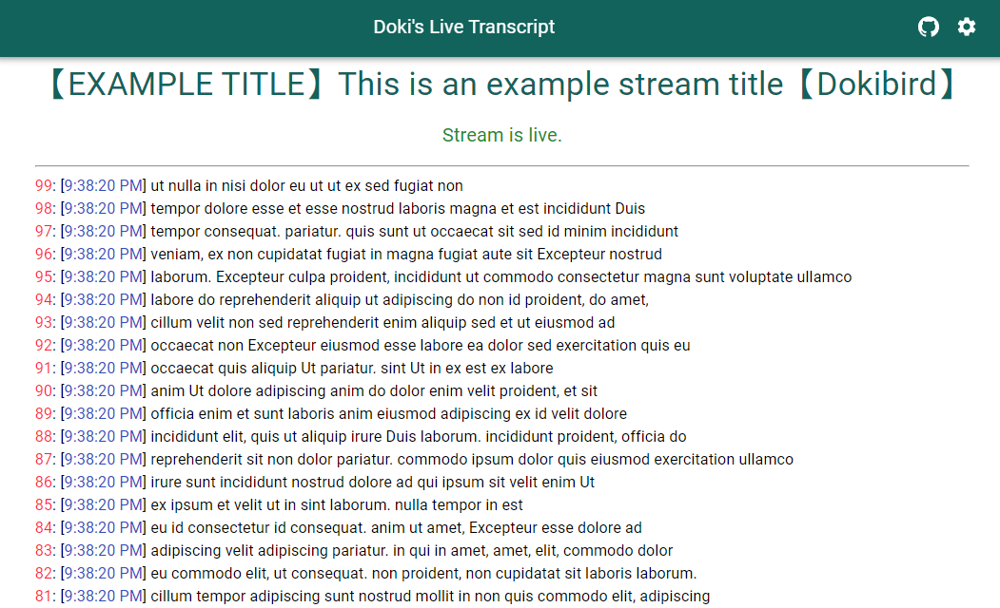
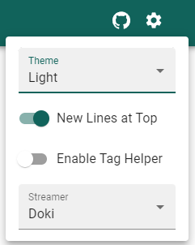
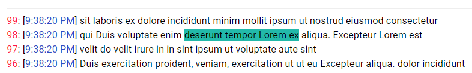
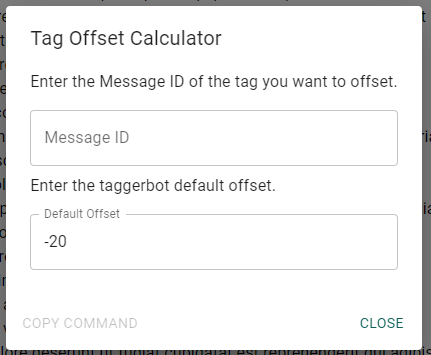
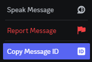
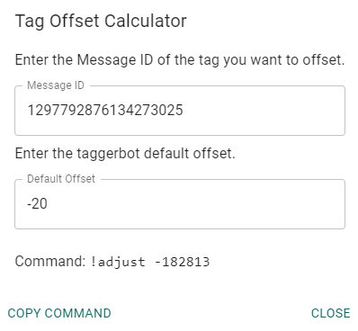

# live-transcript

Transcribes a live stream near real-time with a live latency of 4-6 seconds.

## Overview

_General_

-   **[Settings](#settings)**
-   **[Fix out-of-sync transcript](#fix-out-of-sync-transcript)**
-   **[Tagging Feature](#tagging-feature)**
-   **[Tagging Feature Notes](#note)**

_Development_

-   **[Tech Used](#tech-used)**
-   **[Running Locally](#running-locally)**
-   **[Contributing](#contributing)**
-   **[Contributing Ideas](#contrubiting-ideas)**
-   **[Building a Release](#building-a-new-release)**
-   **[Release Process](#release-process)**

## How To Use



### Settings

Settings are at the top right of the page. Click the cogwheel icon to view the settings menu.



There are currently 4 settings. All settings are stored in a cookie and persist across sessions.

-   Theme: Select the color theme of the site. Light, Dark, or System default.
    > System default will use whatever you set in your operating system. This is set by default.
-   New Lines at Top
    > When enabled, new lines will appear at the top. When disabled, new lines will appear at the bottom. When disabled, you will need to constantly scroll down to see the newest lines.
-   Enable Tag Helper
    > This enables a feature to help time a tag with the text that appears in the transcript. This will be explained further in [Tagging Feature](#tagging-feature).
-   Streamer
    > This denotes what transcript to pull in. Currently only supports Doki.

### Fix out-of-sync transcript

Each line in the transcript has an ID associated with it. This allows you to tell whether your tags are out of sync.

In the event that you are out of sync with the server, please refresh the page. Every page refresh will pull in the current state of the server and you will be back in sync.

### Tagging Feature

The tagging feature allows you to time a tag to a place in the transcript. This feature is off by default, so you will need to enable it in the settings.

Once enabled, you will be able to hover over the text in the transcript and click specific sections (denoted by the color box that appears).



These sections denote a specific part where you can set the tag to (the tags will be set to the beginning of the section).

Once you find the section you want to time a tag to; click it and a menu will appear.



This is the tagging alignment menu. It takes the discord message ID of your tag, and calculates the offset you need for it to align with the beginning of the segment you selected.

If you do not know how to get the message ID of your tag:

1. Enable developer mode. Settings -> Advanced -> Enable developer mode
2. Right-click on your message and click `Copy Message ID`



The default offset is whatever your server's tagger bot is set to. For DPS, it is -20. This value is also stored in the cookie, so you will only have to change it once.

Once both values are set, it will display the adjust command to run. As well as enable the button `Copy Command` to copy the command to your clipboard.



#### Note

1. As said above, this will time the tag to the beginning of the section you clicked. Meaning, that if an entire line is one section, then it will time it to go at the beginning of that line. The only way to make it start in the middle of a section is to guess how long a section is and change the offset accordingly.
2. The timings seem to be _very_ accurate. When you want to start at the beginning of the section, it might be best to move it back by one second to give the YT player time to start the video/audio. Though this should be determined after testing it out for a few streams.

## Development

### Tech Used

-   Node 22
-   Vite to run locally
-   React18
-   MUI 5

### Running Locally

1. Have Node 20 or later installed
2. Clone the repo locally
3. Run `npm install` to install dependencies
4. Run `npm run dev` and open the site it gives you. It should be next to `Local: <site link>`

Every time you save, Vite will automatically refresh the cache and the site should refresh with the new changes.

To mock the transcript, go to the `src/providers/TranscriptProvider.jsx` and change

```js
const [transcript, setTranscript] = useState([]);
```

to

```js
const [transcript, setTranscript] = useState(examples.generateTranscript(100, 3, 4));
```

where you can use anything from the examples file. generateTranscript is just the easiest to generate large amounts of data.
You can also change the initial values for the other variables to whatever you want. Just make sure to revert back to the original before committing.

### Contributing

1. create a branch and put your code onto it.
2. Run `npm run test` and `npm run format` and make sure everything is all good.
    > `npm run lint` is not working right now.
3. Push, raise pr, I'll approve.

### Contrubiting ideas

Raise an issue and detail what idea you have or would like to see.

### Building a new release

This repo holds the dev code. The release code is stored on the `duckautomata.github.io` repo.
I do it this way to ensure that I only have one GitHub Pages repo. And it makes it easier to integrate all apps and make it look consistent.

#### Release Process

Once a new version of the app is ready to go.

1. Run `npm run build`
2. Copy the contents of `/live-transcript` and paste them into this repos folder over in the `duckautomata.github.io` repo. (make sure to delete the existing folder first)
3. Push changes to a new branch and open a PR.
4. Once PR is merged. Changes should be released.
