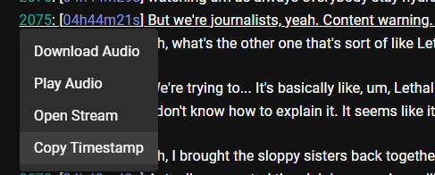

## Livestream Clipper (Video and Audio)

### Requirements
- ffmpeg install either globally or have the binary located in the folder where you will be running this script (or change the ffmpeg location in the script)
- [yt-dlp binary](https://github.com/yt-dlp/yt-dlp?tab=readme-ov-file#installation) install globally or in the same folder that you are running the script.
- powershell (if you don't have powershell7, then you need to change the script from `pwsh` to `powershell`)

### Installation
1. If you already have yt-dlp installed, get a second copy and name it `yt-dlp-stream-clipper`.
2. Run `yt-dlp-stream-clipper--update-to bashonly/yt-dlp@live-from-sections`
> Main branch of yt-dlp does not currently support --live-from-start and --download-sections at the same time. So we will have to use a feature branch that does.
3. save the powershell script locally. Name the file extension `.ps1`
```powershell
$url = Read-Host -Prompt "Livestream URL"
Write-Host "Using url for this session"
while ($true) {
  $startTimestamp = Read-Host -Prompt "Start UNIX"
  $endTimestamp = Read-Host -Prompt "End   UNIX"

  try {
    $startSeconds = [int]$startTimestamp 
    $endSeconds = [int]$endTimestamp

    $startTimestamp = [Math]::Max(0, $startSeconds - 6)
    $endTimestamp = $endSeconds + 2
  } catch {
    Write-Error "Invalid Unix timestamp format. Please provide integer values."
    continue
  }

  $clipName = Read-Host -Prompt "Enter the clip name (without extension)"
  $audioOnly = Read-Host -Prompt "Audio only? (y/n)"

  $audioCommand = ""
  if ($audioOnly -eq "Y" -or $audioOnly -eq "y") {
    $audioCommand = '-f "ba"'
  }

  Write-Host "Starting download. Close the new window that opens up when it gets stuck at the last frag."
  Start-Process pwsh -ArgumentList '-NoExit', '-Command', "yt-dlp-stream-clipper $url $audioCommand --live-from-start --download-sections '*$startTimestamp-$endTimestamp' -o temp.mp4" -Wait

  Get-ChildItem -Path . -Filter *.ytdl | Remove-Item -Force
  Get-ChildItem -Path . -Filter *.mp4.part | Rename-Item -NewName { $_.Name -replace '.part$', '' }

  $files = Get-ChildItem -Path . -Filter "temp.f*.mp4" | Sort-Object Name
  $filesArgument = ""
  foreach ($file in $files) {
      $filesArgument += "-i $file "
  }
  $filesArgument = $filesArgument.TrimEnd()
  Invoke-Expression "ffmpeg $filesArgument -c copy temp.mp4" > $null

  $files | ForEach-Object { Remove-Item $_.FullName }

  # If the name is empty, generate a timestamp
  if ([string]::IsNullOrEmpty($clipName)) {
      $timestamp = Get-Date -Format "yyyyMMddHHmmss"
      $clipName = "file_$timestamp"
      Write-Host "No name provided, using timestamp $timestamp"
  }

  if ($audioOnly -eq "Y" -or $audioOnly -eq "y") {
    ffmpeg -i "temp.mp4" "$clipName.mp3" > $null
    Remove-Item -Path "temp.mp4" -Force
  } else {
    Rename-Item -Path "temp.mp4" -NewName "$clipName.mp4"
  }
}
```

4. Run the script in powershell. If all went well, it should prompt you for some info

### How to use
When you run the script, it will prompt you for five things
1. livestream url
2. start timestamp in unix time
3. stop timestamp in unix time
4. clip name
5. (y/n) if this should only be an audio clip

Once the livestream url is entered, it will reuse it after every clip download.

You can grab the start and stop unix timestamp from the live-transcript website https://duckautomata.github.io/live-transcript/. Click the id of the line you want to grab the timestamp for, and click `Copy Timestamp` from the popup. This will copy the timestamp that starts at the beginning of the line. This is important as, if you want to clip and entire line, you would need to use the id of the next line. Since the start of line 30 is the end of line 29.


> this will copy the timestamp that starts at line 2075. Which would be right before/when they are saying "But we're".

**NOTE**: The timestamps are not perfect and can be off 5-10 seconds. Though that is rare, you might find it best to overestimate rather than try to be exact. There really is no harm in the clip being 10 seconds longer in either direction.
> By default, the clip will automatically start 6 seconds earlier and end 2 seconds later (8 seconds longer clip)

Clip name is what it sounds like. The name of the clip without the extension. If you do not provide input, it will use a timestamp name.

AudioOnly is a yes/no option on whether you want this to be a video clip or just an audio clip. Defaults to no


#### Clipping part

Once you fill out all the prompts, it will start the clipping process by opening another powershell window and running yt-dlp to grab the clip. This will download all the fragments, **but it will get stuck at or near the last one**. Once it is stuck with one or two remaining, close the window. This is incredibly scuffed, but it works!


> it was stuck like this for several seconds, so I closed the video and the clip finished.

When the yt-dlp window is closed, the script will continue to process the downloaded files and merge them into one.
When it is done, it will prompt you for another timestamp to clip.